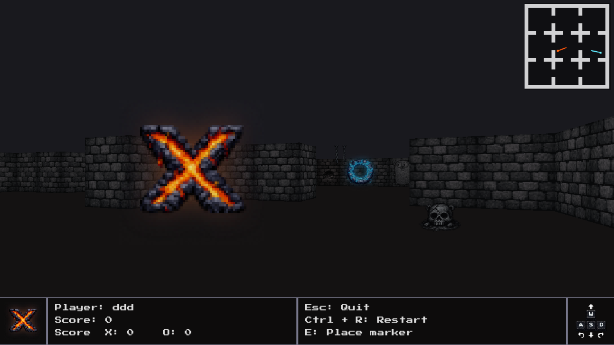

# Gopher Dungeon

Gopher Dungeon is a 3D Tic-Tac-Toe game with a pixelated dark dungeon vibe, transforming the classic 2D grid into a turn per turn 3D game. Instead of placing marks on a flat board, you explore a simple maze of rooms where each room represents a single cell of the Tic-Tac-Toe grid. The world is built using raycasting, simulating a retro 3D environment similar to Wolfenstein 3D.

The game is written in `Go` and runs in the browser using `WebAssembly`. It uses a custom raycasting engine inspired by og games like Wolfenstein 3D. The 3D rendering is built from scratch using the DDA (Digital Differential Analyzer) algorithm to make raycasting fast and efficient.

[**Play it on GitHub Pages**](https://yungbricocoop.github.io/gopher-dungeon/)

## References

- **Project Report**: [docs/report.typ](docs/report.typ)
- **Raycasting Tutorial**: [Lode's Computer Graphics Tutorial](https://lodev.org/cgtutor/raycasting.html)

## Changelog

**13.01.26** :

- Final Version Improvements

Improved the HUD by splitting frames differently suitable for different screen sizes and added a speed multiplier when pressing shift for faster movement. Added the MIT License file.

**12.01.26** :

- CI/CD Finalization

Updated the CI pipeline to run tests using xvfb to emulate x11 which is required for Ebitengine tests. Added the final project report.

**11.01.26** :

- HUD

Implemented the HUD system to display game information to the player overlaying the 3D view.

**31.12.25** :

- Wall Textures and Full Screen

Implemented texture rendering on walls replacing solid colors.

**30.12.25** :

- Core Raycasting Engine

Implemented the core raycasting drawing logic, calculating wall distances and projecting them to the screen column by column.

**05.12.25** :

- CD

Added a CD pipeline to build the application to WebAssembly and publish it automatically to GitHub Pages.

**28.11.25** :

- CI : Add GitHub Actions workflow for golangci-lint

Creation of `.github/workflows/golangci-lint.yml` file, the action used it the official one from golangci-lint : https://github.com/golangci/golangci-lint-action

**21.11.25** :

- Add golangci-lint configuration file

Creation of `.golangci.yml` file, the file contains a known config from : https://gist.github.com/maratori/47a4d00457a92aa426dbd48a18776322. This will help improve code quality over the whole project.

**02.11.25** :

- Upgrade deprecated ebiten text to v2

The `github.com/hajimehoshi/ebiten/v2/text/v2` package is now used instead of the deprecated `github.com/hajimehoshi/ebiten/v2/text` package. The `text.Draw` signature has changed and now it takes less arguments, so we need to create a DrawOption object that stores translation information.

## License

Distributed under the MIT License. See [LICENSE](LICENSE) for more information.
